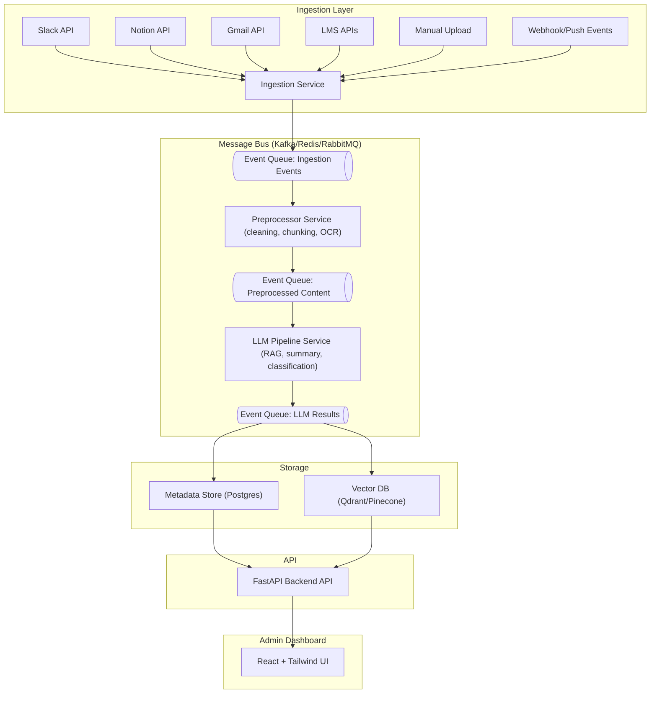
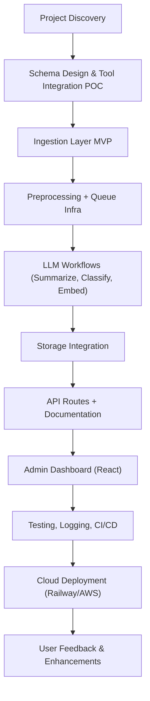

# Proposal: Full Stack (LLM, Integrations, SaaS) – Intelligent Knowledge Management Platform

Hello,

I'm excited about your vision to build an AI-powered knowledge platform that helps teams unify, process, and retrieve their internal knowledge across fragmented tools. Below is a technical proposal detailing how I would approach designing and building your MVP.

---

## How I Understand the Challenge

You are building a B2B SaaS platform to:

1. **Ingest and intelligently process unstructured content** (calls, chats, documents).
2. **Apply LLM-powered workflows** to summarize, classify, and semantically index content.
3. **Integrate with tools** like Notion, Gmail, Slack, LMS to unify knowledge sources.
4. **Automate internal knowledge discovery and retrieval** via a performant API and admin UI.
5. **Deliver a scalable, decoupled architecture** ready to grow with usage and data volume.

---

## System Architecture (Subsystems Overview)

### 🎯 Key Design Principles

- **Decoupling** via message-based communication (Kafka/Redis/RabbitMQ).
- **Async pipelines** for ingestion, processing, and storage.
- **LLM modularity** via LangChain/RAG interfaces.
- **UI & API separation** for clean scalability and team collaboration.
- **Stateless microservices** with retriable, observable jobs.

---

### 🧩 System Architecture Diagram

---

## 🛠 Subsystem Breakdown

### 1. **Ingestion Layer**

**Role**: Connect to external tools (Slack, Notion, Gmail, LMS) and receive data via API/webhook. Normalize and push ingestion events to the queue.

- Handles auth (OAuth2)
- Pulls or listens for new messages/files
- Emits event to ingestion queue (`ingestion.new_content`)

### 2. **Message Queue/Event Bus**

**Role**: Decouple all services to ensure scalability, fault tolerance, and retries.

- Kafka (preferred for scale) or Redis Streams/RabbitMQ for dev agility
- Topics: `ingestion`, `preprocessing`, `llm_processing`

### 3. **Preprocessing Service**

**Role**: Clean and transform input content for LLM processing.

- Split content into chunks
- Normalize formats
- OCR for images/PDFs
- Emit processed chunks to next queue

### 4. **LLM Pipeline**

**Role**: Apply language model workflows.

- Summarize content using OpenAI/Claude
- Classify content by topic/source/urgency
- Generate vector embeddings using OpenAI or Sentence Transformers
- Emit results to storage queues

### 5. **Storage Layer**

**Role**: Persist results for API and dashboard use.

- Postgres: Metadata (summary, tags, document lineage)
- Qdrant/Pinecone: Vector embeddings with metadata ID links

### 6. **API Layer**

**Role**: Provide public access to search, retrieve, or manage processed content.

- Built with FastAPI
- `/search`, `/document/{id}`, `/status`, `/connect`, etc.

### 7. **Admin Dashboard**

**Role**: Web UI for internal ops, monitoring, and manual actions.

- React + TailwindCSS
- Pages:
  - Ingestion connections
  - Content search & preview
  - Processing logs
  - Retry/monitor LLM jobs

---

## 🚧 System Development Lifecycle

---

## 📋 Clarification Questions

1. **Who will use the Admin Dashboard?**  
2. **What tools are mandatory in MVP integrations?**  
3. **Should the system support multi-tenancy from day one?**  
4. **Any preference or constraints for deployment environment?**  
5. **What are your priorities for the MVP?**

---

## Suggested Stack Choices & Justifications

| Layer               | Choice                      | Rationale                                                          |
|--------------------|-----------------------------|--------------------------------------------------------------------|
| API                 | FastAPI                     | Async, simple, scalable                                            |
| Async Jobs         | Celery + Redis (or Prefect) | Easier dev/ops than Temporal unless workflow state is complex      |
| Message Queue      | Redis Streams or Kafka      | Kafka for scale, Redis Streams for agility                         |
| Vector DB          | Qdrant                      | Open-source, performant, dev-friendly                              |
| LLM Orchestration  | LangChain or Custom         | Modular, supports prompt chains, fallback routing                  |
| Frontend           | React + TailwindCSS         | Fast internal dashboard development                                |
| Auth               | Clerk                       | Fast setup, UI widgets, extensible                                 |
| Deployment         | Railway / AWS / Docker      | Supports all MVP components well                                   |

---

## 🚀 Why Me

- I specialize in architecting, designing and building decoupled, scaleable and resilient AI-powered systems using FastAPI, LLM pipelines, and many other tools.
- I have over 15 years experience of delivery such systems to billion dollars businesses that supports billions of users, and I'm confident that I can do help you achieve your aims.
- I have hands-on experience with vector search, OAuth integrations, and knowledge graph architectures.
- I prefer clean, extensible system designs with developer ergonomics and long-term scalability baked in.

Best regards,  
Philip Goden  
