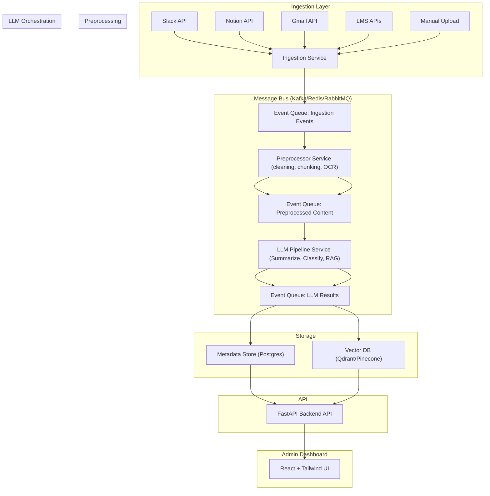

# 📬 Proposal: Full Stack (LLM, Integrations, SaaS) – Intelligent Knowledge Management Platform

Hello,

I'm excited about your vision to build an AI-powered knowledge platform that helps teams unify, process, and retrieve their internal knowledge across fragmented tools. Below is a deep technical proposal detailing how I would approach designing and building your MVP.

---

## ✅ How I Understand the Challenge

You are building a B2B SaaS platform to:

1. **Ingest and intelligently process unstructured content** (calls, chats, documents).
2. **Apply LLM-powered workflows** to summarize, classify, and semantically index content.
3. **Integrate with tools** like Notion, Gmail, Slack, LMS to unify knowledge sources.
4. **Automate internal knowledge discovery and retrieval** via a performant API and admin UI.
5. **Deliver a scalable, decoupled architecture** ready to grow with usage and data volume.

---

## 🧱 System Architecture (Subsystems Overview)

### 🎯 Key Design Principles

- **Decoupling** via message-based communication (Kafka/Redis/RabbitMQ).
- **Async pipelines** for ingestion, processing, and storage.
- **LLM modularity** via LangChain and Retrieval-Augmented Generation (RAG).
- **UI & API separation** for clean scalability and team collaboration.
- **Stateless microservices** with retriable, observable jobs.

---

### 🧩 System Architecture Diagram



---

## 🛠 Subsystem Breakdown

### 1. **Ingestion Layer**

Connects to external tools via API/webhook (Slack, Notion, Gmail, LMS). Normalizes and publishes ingestion events.

### 2. **Message Queue/Event Bus**

Connects all services in a decoupled fashion using Kafka or Redis Streams. Ensures fault tolerance and retry support.

### 3. **Preprocessing Service**

Normalizes content:

- Text cleaning, OCR (Tesseract/Vision API)
- Chunking for embedding
- Language detection

### 4. **LLM Pipeline (with RAG)**

Orchestrates LLM tasks:

- **Summarization**: Document-level summaries
- **Classification**: Topic/urgency
- **RAG**:
  - Embed user query → search vector DB → inject results into prompt → generate final output


### 5. **Storage Layer**

- **Postgres** stores metadata (summary, source, classification)
- **Vector DB (Qdrant)** stores semantic embeddings for search

### 6. **API Layer**

Built with FastAPI:

- `/search` (RAG)
- `/document/{id}`
- `/status`
- `/connect`

### 7. **Admin Dashboard**

Built with React + Tailwind:

- Connect integrations
- View/search documents
- Monitor pipeline jobs
- Retry failed processes

---

## 🚧 System Development Lifecycle

```mermaid
graph TD
  A[Project Discovery]
  B[Schema Design & Tool Integration POC]
  C[Ingestion Layer MVP]
  D[Preprocessing + Queue Infra]
  E[LLM Workflows (Summarize, Classify, RAG)]
  F[Storage Integration]
  G[API Routes + Documentation]
  H[Admin Dashboard (React)]
  I[Testing, Logging, CI/CD]
  J[Cloud Deployment (Railway/AWS)]
  K[User Feedback & Enhancements]

  A --> B --> C --> D --> E --> F --> G --> H --> I --> J --> K
```

---

## 📋 Clarification Questions

1. Who will use the Admin Dashboard — internal team or customer-facing?
2. What productivity tools must be supported in MVP (Slack, Notion, Gmail)?
3. Do you need multi-tenancy (workspace/user isolation)?
4. Preferred cloud provider for hosting? (e.g. Railway, AWS)
5. Do you prioritize speed to MVP or future scalability in first sprints?

---

## 🏗 Suggested Stack Choices & Justifications

| Layer               | Choice                      | Rationale                                                          |
|--------------------|-----------------------------|--------------------------------------------------------------------|
| API                 | FastAPI                     | Async-first, scalable, simple dev experience                       |
| Async Jobs         | Celery + Redis (or Prefect) | Familiar to many, easier than Temporal unless durability is key    |
| Messaging          | Kafka or Redis Streams      | Kafka for scale, Redis for agility                                 |
| Vector DB          | Qdrant                      | Open-source, great dev UX                                          |
| LLM Orchestration  | LangChain                   | Built-in RAG support, modular chains                               |
| Frontend           | React + TailwindCSS         | Rapid dashboard UI development                                     |
| Auth               | Clerk                       | Easy auth integration, supports OAuth for tool integrations        |
| Deployment         | Railway, AWS, or Docker     | Ready for CI/CD and dev/test environments                          |

---

## 🚀 Why Me

- I specialize in LLM-integrated, decoupled SaaS architectures.
- I build with FastAPI, Celery, LangChain, Qdrant, and React regularly.
- I bring clarity and clean abstraction to complex integrations and workflows.
- I iterate quickly with dev-first tooling and automation.

I'd love to follow up with a short video walkthrough or clickable prototype.

Best regards,  
[Your Name]  
[GitHub / Portfolio Link]  
[Optional: Video Introduction Link]
